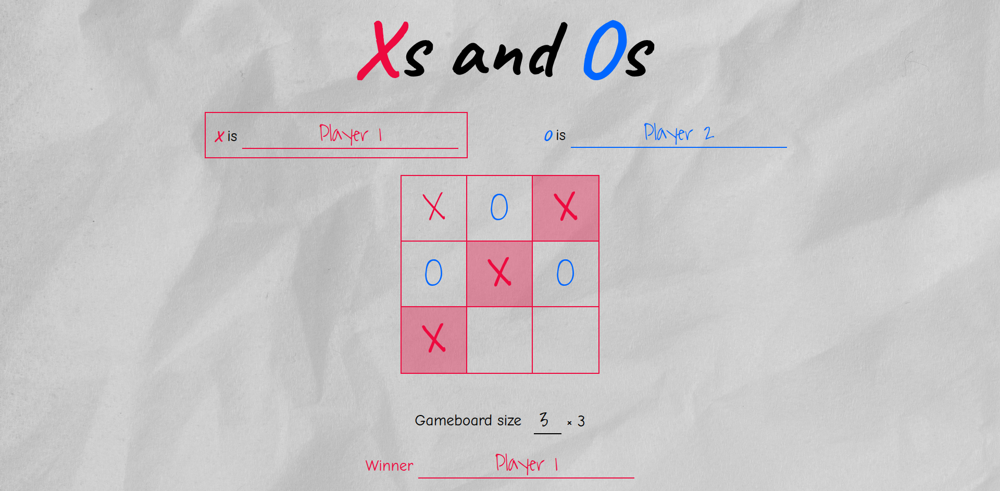

# Tic-Tac-Toe

<!-- Screenshot is going to be replaced after adjustments have been made to the project. -->
<!--  -->

A game of _[tic-tac-toe](https://en.wikipedia.org/wiki/Tic-tac-toe)_ ([also known as](https://en.wikipedia.org/wiki/Tic-tac-toe#Names) _noughts and crosses_ and _Xs and Os_ ) that you can play with a friend in your web browser.

This project was created as part of my journey in the [Full Stack JavaScript](https://theodinproject.com/paths/full-stack-javascript) path of [The Odin Project (TOP)](https://theodinproject.com), as a practice on [Factory Functions and The Module Pattern in JavaScript](https://theodinproject.com/lessons/node-path-javascript-factory-functions-and-the-module-pattern).

> [!NOTE]
> Despite being primarily a practice project, contributions are still welcome — you can try resolving any [issues](https://github.com/alikamel-dev/homepage/issues), or, if you think you have found an issue, [create an issue](https://github.com/alikamel-dev/homepage/issues/new) or solve it and [create a pull request](https://github.com/alikamel-dev/homepage/compare).

## Playing the Game

You can play the game on its [GitHub Pages website](https://alikamel-dev.github.io/tic-tac-toe).

If you like my project, please support me by **starring its repository on GitHub** and **liking it on the project's [community solutions page](https://theodinproject.com/lessons/node-path-javascript-tic-tac-toe/project_submissions)**.

### Before you play

#### Supported devices and browsers

The game is designed to be played in a **a maximized [Google Chrome](https://google.com/chrome) browser window on a 1920 × 1080 monitor**.

Currently, The website is _not_ completely responsive, and is thus likely to produce worse visual results on smaller screen sizes, especially mobile devices, though this issue can be mitigated by loading the desktop version of the website.

The game may look slightly different in web browsers other than Chrome, but it should function properly on reasonably new versions of all of the major web browsers.

> [!NOTE]
> If you encounter an issue with the game, feel free to [create an issue](https://github.com/alikamel-dev/homepage/issues/new).

#### How to Play

If you know how tic-tac-toe is played, you should be able to play this web version of it without trouble. The following step-by-step guide is mostly for documentation purposes.

1. Enter the names to be used for the players playing as _X_ and _O_ (or simply leave the default names as-is)   There is no restriction on the types of characters used in player names, but **a player name may not consist solely of whitespace characters**, and **the two players may not have the same name, two names consisting of the same characters but with different letter cases, or two names only differing in the number of leading/trailing spaces**.    **The player whose mark is X plays first**.

2. You may also set the gameboard size (that is, the number of rows and columns of the gameboard), or leave it at the default value of `3` (3 rows and 3 columns, the gameboard of a traditional tic-tac-toe game).   Gameboard size can be any integer value from `3` to `10` (inclusive), though larger sizes may cause the page to overflow the browser viewport, forcing players to scroll up and down to reach desired cells.

3. Click the "New Game" button to start a new game with the specified settings.

4. The name of the player of the current turn will be surrounded by a box.   Each player should click on the cell of the gameboard they wish to mark.

5. The winner is **the first player to mark all of the cells in a single row, column, or diagonal** - If all cells of the gameboard are marked before either player manages to do so, then neither player wins.

6. After the game ends, you can edit the gameboard size, and choose whether to swap player marks on starting the new game, and click "New Game" to start a new game with the new settings.   You may also start a new game in the middle of one in progress, but you may only edit the gameboard size in this case.

> [!TIP]
> If you wish to edit player names, click the _Home_ button at the bottom of the page to end the current game and return to the homepage.

## Design

The design of this project aims to make it look more like an activity page in an elementary school workbook, albeit more colorful, with user-generated content (player names and marks on the gameboard) looking like the writing of children on it.

This direction affected the choice of [background image](#background-image), [fonts](#fonts) and [colors](#colors).

### Background Image

The background image is [_white textile on a brown wooden table_](https://unsplash.com/photos/white-textile-on-brown-wooden-table-_kUxT8WkoeY) by [Marjan Blan on Unsplash](https://unsplash.com/@marjan_blan).

### Fonts and Colors

### Fonts

The following are the main fonts used for this project. Each link leads to the respective [Google Fonts](https://fonts.google.com) page of the font.

| Type of text                                | Font                                                                                 |
|---------------------------------------------|--------------------------------------------------------------------------------------|
| Title and Player marks (not user-generated) | [Caveat](https://fonts.google.com/specimen/Caveat)                                   |
| Main text                                   | [Comic Neue](https://fonts.google.com/specimen/Comic+Neue)                           |
| User-generated content                      | [Waiting for the Sunrise](https://fonts.google.com/specimen/Waiting+for+the+Sunrise) |

### Colors

The following are the colors used for this project. Each link leads to the respective [ColorHexa](https://colorhexa.com) page of the color.

[Crayola](https://crayola.com) colors have been obtained from this [list of Crayola crayon colors on Wikipedia](https://en.wikipedia.org/wiki/List_of_Crayola_crayon_colors#Standard_colors).

| Type of item                 | Color                                                                                          |
|------------------------------|------------------------------------------------------------------------------------------------|
| Main text                    | [`#000000`](https://colorhexa.com/000000) (Black)                                          |
| Player 'X' mark              | [`#ED0A3F`](https://colorhexa.com/ED0A3F) ([Crayola](https://crayola.com/) Red)        |
| Player 'O' mark              | [`#0066FF`](https://colorhexa.com/0066FF) ([Crayola](https://crayola.com/) Blue (III)) |
| Draw/Input placeholder       | [`8B8680`](https://colorhexa.com/8B8680) ([Crayola](https://crayola.com/) Gray)        |
| Selection background         | [`hsl(60, 100%, 45%)`](https://colorhexa.com/E6E600) with `85%` opacity                  |

The selection background color is based on _Maximum Yellow_ Crayola color ([`#FAFA37`](https://colorhexa.com/FAFA37)), with modifications to saturation, lightness, and opacity.

## Other Projects

Feel free to view my other projects on [my website](https://alikamel-dev.github.io/homepage).
